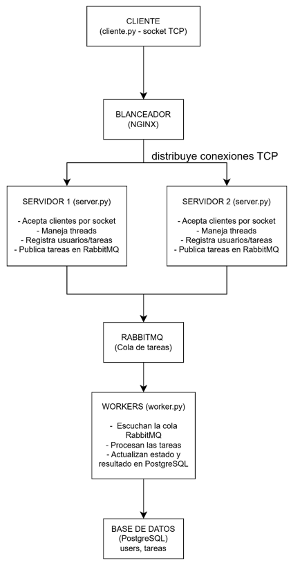

# PFO 3 - Sistema Distribuido de tareas (Cliente-Servidor)

## Descripcion
Proyecto desarrollado para la materia Programación en Redes de la Tecnicatura en Desarrollo de Software en el IFTS 29.

Implementación de un sistema de gestión de tareas que permite:
* Registrar usuarios
* Crear tareas asociadas a los usuarios
* Enviar tareas a un servidor que las distribuye a workers usando RabbitMQ
* Workers que "procesan" las tarea y actualizan su estado en la base de datos.

## Arquitectura del sistema
El sistema está diseñado con los siguiente componentes:



## Componentes Clave
* **Clientes**: Envían tareas al servidor vía sockets y reciben confirmaciones/actualizaciones.
* **Servidor**: Recibe tareas, las envía a la cola RabbitMQ para ser procesadas por los Workers. Gestiona también registro y login de usuarios. 
* **Workers**: Consumen tareas de RabbitMQ, simulan procesamiento con time.sleep y actualizan el estado en PostgreSQL.
* **RabbitMQ**: Cola de mensajes para comunicación entre servidor y workers.
* **PostgreSQL**: Almacenamiento de usuarios, tareas y estados.

## Requisitos
* Python 3.10+
* Docker

## Instalación
1. Clonar el repositorio
```
    git clone https://github.com/MacaGQ/PFO3_Redes_Sistema_Distribuido.git
```

2. Crear `.env` a partir de `.env.example`:
```
    copy .env.example .env
```
3. Configurar las variables de entorno en `.env`:
```
    POSTGRES_USER=testuser
    POSTGRES_PASSWORD=testpass
    POSTGRES_DB=tasks_db
    POSTGRES_HOST=localhost
    POSTGRES_PORT=5432

    RABBITMQ_USER=rabbituser
    RABBITMQ_PASSWORD=rabbitpass
    RABBITMQ_HOST=localhost
    RABBITMQ_PORT=5672
    RABBITMQ_QUEUE=tasks
```

4. Levantar contenedores de PostgreSQL y RabbitMQ:
```
    docker compose up -d
```

## Uso
### Servidor
```
    python server.py
```
* Escucha por tareas desde los clientes
* Envia tareas a RabbitMQ para que los workers las procesen

### Worker
```
    python worker.py
```

* Consume tareas de RabbitMQ
* Simula procesamiento (time.sleep)
* Actualiza estado de tareas en PostgreSQL `Procesando -> Completada`

### Cliente
Permite interactuar con el servidor mediante **sockets** y **json**.

```
    python client.py
```

#### Funcionalidades:
1. Registro de usuario con `username` y `password`
2. Inicio de sesión con `username` y `password`
3. Gestion de Tareas. Una vez iniciada la sesión el usuario puede:
    * Ver tareas existentes
    * Crer nuevas tareas
    

### Base de datos
Tablas principales:
* **users**: `ID`, `username`, `password`
* **tasks**: `ID`, `user_id`, `task`, `status` (`Procesando` o `Completada`)


